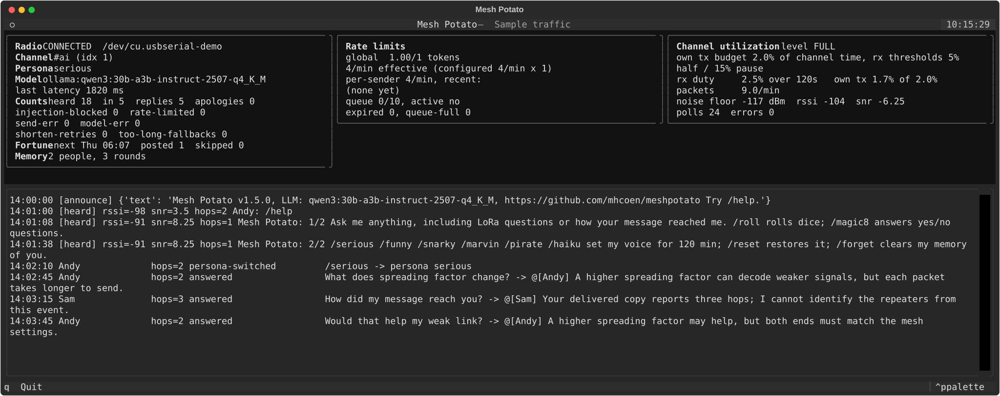

# Mesh Potato

[](https://www.python.org/)
[](LICENSE)
[](#development)

A chat bot for a [MeshCore](https://meshcore.co.uk) channel. Mesh Potato runs on a
computer with a MeshCore companion radio on USB, listens on one channel,
answers questions using a language model running on the same computer, and
posts a one sentence reply back to the channel as `@[sender] answer`. Every
message and every reply passes a built-in prompt injection detector before it
can reach the model or the radio.

It is a small Python package with no web interface or database server.
A local SQLite file keeps recent conversations across restarts.

A live instance runs on the `#ai` channel of the MeshCore mesh in
southern Wisconsin, centered on Madison. If you are on that mesh, add `#ai`
in your MeshCore app and say something. It targets about 2 percent of the
channel's time for its own transmissions, never answers closer than 15 seconds
apart, and backs off when the channel is busy. Questions wait in a bounded
queue, so a delayed answer can mean congestion rather than a fault.

## Screenshots

What you see, in the terminal monitor: radio and channel state, rate limits,
channel utilisation, and every message with the bot's decision on it
(current UI with sample traffic):



## Features

- Answers questions on one MeshCore channel, skipping bare reactions and
  lines addressed to someone else, and staying out of conversations between
  other people. On a shared channel, an optional trigger prefix such as `!ai`
  limits it to messages meant for it
- Per-person memory of recent exchanges, preserved across restarts so follow-up questions make sense.
  Overlapping exchanges appear only once in model context; `/forget` clears
  your personal memory, not the shared channel history
- Talks LoRa, not information theory. It knows the mesh's settings and what
  each one trades off, reads its own frequency, bandwidth, and power from the
  radio at startup, and selects relevant passages from a small
  [sourced, offline radio reference](docs/context-and-knowledge.md)
- Local model through Ollama, or any OpenAI compatible chat endpoint
- Ask "How did my message reach you?" for an explanation using that question's
  reported hop count, RSSI and SNR, when available; see [Reception](docs/reception.md)
- Warm, helpful answers by default with `/nice`. Other personalities are by
  request: `/funny`, `/snarky`,
  `/marvin`, `/pirate`, `/haiku`, `/serious` (straight answers without jokes),
  with `/help` and `/reset`. A switch reverts
  after two hours. Presets live in `config.toml`; write your own
- A daily fortune, silly and unprompted, a little after six every morning,
  independent of the channel's current personality
- Automatic web lookup for current-information questions, plus `/web` to request
  a search; one short answer with a source domain, or an honest inability to verify
- Prompt injection gate on every channel line, the prompt, the assembled
  context, and the reply
- Polite on the air: a target share of channel time for its own
  transmissions, measured from the radio's airtime counters, and automatic
  slowdown when the channel is busy

## Also

- One sentence ASCII answers, automatically sized to fit the radio's
  160-byte limit including the node name and mention; sender names are
  mentioned exactly as sent
- Loop guard, prompt length cap, hard model timeout with a fixed apology
- Rate limits, global and per sender, as a burst floor; up to ten waiting
  questions and one active answer, with waiting work expiring after ten
  minutes
- Recent channel history given to the model as untrusted background, never
  as prior chat turns
- Terminal monitor with a live message log, rate limiter state, channel
  utilisation, and counters; JSON lines log; headless mode for services
- Announces its name, version, LLM, repository link, and a help hint (when it fits) once at startup; clean shutdown on SIGINT
  and SIGTERM
- Tests that need no radio, no model, and no network

## Channel commands

Just send a message to chat; no command is needed. With the default presets:

| Command | What it does |
| --- | --- |
| `/help` | Sends two help pages automatically |
| `/serious` | Straight, factual answers without jokes |
| `/nice` | Warm, helpful answers; the default voice |
| `/funny` | Dry humor, by request |
| `/web question` | Search the web and summarize available evidence in one sentence |
| `/snarky` | Sharp, unimpressed humor |
| `/marvin` | A brilliant, deeply depressed robot |
| `/pirate` | A cheerful pirate |
| `/haiku` | Answers as a one-line haiku |
| `/reset` | Restores the default personality immediately |
| `/forget` | Clears the bot's personal memory of you, not shared channel history |
| `/roll` | Rolls two six-sided dice by default; accepts a dice count and sides per die, e.g. `/roll 3 8` or `/roll 3,8` |
| `/magic8` | Gives a random Magic 8 Ball answer; an optional yes/no question can follow |

Personality switches are silent, affect the whole channel, and revert after
two hours by default. If a trigger prefix is configured, put it before the
command, for example `!ai /help`. See [Personalities](#personalities) for
configuration, command details, and limits.

## What you can ask

Ask a question in ordinary language. For example:

- "What does spreading factor change?"
- "How did my message reach you?"
- "Why is the sky blue?"

The bot remembers your recent exchanges, so you can follow up with questions
such as "Can you explain that more simply?" Answers are kept to one short
sentence to fit a radio message. Use `/serious` for straight answers without
jokes, or `/help` to see the available commands. Personality changes affect
everyone on the channel, not just the person who requested them.
You can also use your app's reply button to reply to Mesh Potato; a leading
`@[Mesh Potato] ` mention addresses it directly, even on a channel with a trigger
prefix. To prevent two bots from replying to each other indefinitely, the bot
answers at most two consecutive direct-mention requests from one sender. Send
a plain message to continue; on a channel with a trigger, include that trigger.
An unknown command receives one short help hint.

Questions about current prices, weather, opening hours, news, and similar
changing facts trigger a web lookup. Use `/web your question` when you want to
request a search explicitly. For example, `/web How much is an 8-foot treated
4x4 at Menards Madison East today?` searches for current supporting pages.
Words such as "today" or "tonight" alone do not trigger search. Ordinary
requests such as "What should I cook tonight?" and "Who is W1MHC?" stay with
the model and configured local facts. Include the exact product and store location; sites that require a login,
JavaScript, or a bot check may prevent the bot from finding an answer.

The bot reads up to three public pages and produces one short sentence with
the registrable source domain (for example, `example.co.uk`, without subdomain
text). Hostnames containing recognized abusive phrases are rejected. Full source
URLs and supporting quotations are recorded in the local JSON log. An explicit
`/web` with no usable evidence returns a fixed inability-to-verify response.
An automatic lookup with no evidence can use the remaining budget for a normal
model response with a no-current-facts instruction. Only an unchanged static
operator fact can be used from that fallback; other candidates become the fixed
inability line, so adding "I can't verify" cannot sneak a current claim through.
Fixed web notices may repeat, subject to the normal radio rate limits.
Search snippets alone are never supporting evidence.
Current price answers require a page with product/offer metadata; a fetched
listing still does not prove local stock or the price at a particular store.

Web lookup uses the free DuckDuckGo backend of DDGS and extraction adapted from
Episodic's Muse mode, without installing Episodic. It requires internet access
on the bot's computer. The current question is sent to DuckDuckGo, and the
result pages are fetched directly. Sender names, channel history, radio keys,
and operator notes are not added to the search query. Anything a person puts
in their question can leave the mesh; the channel's `/help` page also explains
this. Set `web_enabled = false` to disable it.
`web_location` defaults to Madison, Wisconsin and supplies a location for local
weather/hours questions that omit one; specify a location in the question to
override it. Dates use the bot computer's local timezone.

Search and all model calls share the same **25-second total budget**. Retrieval
gets at most 12 seconds of that budget; it does not receive a fresh model budget
afterward. A draft that fails source-quote, number, or qualifier checks gets one
repair attempt within the same deadline, then an inability-to-verify response.
Checks require supported content words, matching currency and unit types,
named places/stores in the source, and preservation of recognized qualifiers
across the fetched text. They reject conflicting displayed prices and obvious
dry-versus-rain forecast conflicts; forecasts need a matching date and uncertainty
language. These conservative checks can reject useful pages, especially ones
with multiple prices or unrelated sale/holiday wording. They do not prove
semantic accuracy, freshness of undated listings, or general agreement between
sources. Rejected sources and worker failures have separate JSON log records.
Automatic routing is heuristic; `/web` handles questions it misses.

On a busy channel, allow time for a reply before repeating your question.
The bot spaces out its transmissions and may leave ordinary chatter or
conversations between other people unanswered.

## Quick start

```bash
git clone https://github.com/mhcoen/meshpotato.git meshpotato
cd meshpotato
uv venv --python 3.12
uv pip install -e '.[dev]'
ollama pull qwen3:30b-a3b-instruct-2507-q4_K_M
cp config.example.toml config.toml   # set port, channel_idx, bot_name
.venv/bin/meshpotato --config config.toml
```

The radio needs the MeshCore companion USB firmware, a node name equal to
`bot_name`, your regional radio preset, and the channel it will serve. See
[Prepare the radio](#prepare-the-radio).

## Requirements

- A Mac or Linux computer that stays on. This is a good use for an old
  laptop that is sitting in a drawer: the bot needs no screen once it is
  running, and a reply every 15 seconds at the very most is not much work. The default model
  uses about 18 GB of memory; 32 GB of RAM is a comfortable minimum, 64 GB is
  better. Apple Silicon works well.
- A MeshCore companion radio on USB. Built and tested with a Heltec Wireless
  Paper (ESP32-S3, SX1262) on MeshCore companion firmware 1.17.1. Any board
  with a MeshCore "companion radio USB" build should work.
- Python 3.11 or newer, and git.
- [Ollama](https://ollama.com), or any server that speaks the OpenAI chat
  completions API.

## Installation

The steps below use [uv](https://docs.astral.sh/uv/). Plain `python -m venv`
and `pip` work the same way; pip equivalents are given where they differ.

1. Install uv if you do not have it:

   ```bash
   curl -LsSf https://astral.sh/uv/install.sh | sh
   ```

2. Get the code:

   ```bash
   git clone https://github.com/mhcoen/meshpotato.git meshpotato
   cd meshpotato
   ```

3. Create the environment and install:

   ```bash
   uv venv --python 3.12
   uv pip install -e '.[dev]'
   ```

   With pip:

   ```bash
   python3 -m venv .venv
   .venv/bin/pip install -e '.[dev]'
   ```

   The dependencies are meshcore, ollama, httpx, textual, and confusables,
   which supplies the Unicode look-alike table the injection detector uses.

4. Check that the command exists:

   ```bash
   .venv/bin/meshpotato --version
   ```

### Install the model

1. Install Ollama from https://ollama.com and make sure it is running. On a
   Mac it runs as a menu bar application and listens on
   `http://127.0.0.1:11434`.

2. Pull the model:

   ```bash
   ollama pull qwen3:30b-a3b-instruct-2507-q4_K_M
   ```

   This is about 18 GB. It is a mixture of experts model with about 3 billion
   active parameters, so it answers a short prompt in well under a second on
   Apple Silicon once loaded, with the quality of a much larger model. Use the
   `instruct` variant, not the plain `qwen3:30b-a3b` tag: the plain tag is a
   thinking model that writes its reasoning into the reply even with thinking
   turned off.

   If the `ollama` command misbehaves, the HTTP API does the same job:

   ```bash
   curl http://127.0.0.1:11434/api/pull -d '{"name":"qwen3:30b-a3b-instruct-2507-q4_K_M"}'
   ```

3. Any other Ollama model works by changing `model` in the config. For a
   model that rejects the `think` option, set `ollama_think = "omit"`.

To use a different server (LM Studio, llama.cpp's server, vLLM, or a hosted
API), set `backend = "openai"`, `openai_base_url` to the server's `/v1`
address, `model` to the model name it expects, and put the API key, if the
server needs one, in the environment variable `MESHPOTATO_OPENAI_API_KEY`. The
key is never read from the config file and never written to a log.

### Prepare the radio

Do this once.

1. Flash the companion firmware. Use the
   [MeshCore web flasher](https://flasher.meshcore.co.uk), choose your board,
   and pick the "Companion Radio USB" build. Or download the
   `..._companion_radio_usb_..._merged.bin` for your board from the
   [MeshCore releases](https://github.com/meshcore-dev/MeshCore/releases) and
   flash it with esptool:

   ```bash
   pip install esptool
   esptool --port /dev/cu.usbserial-0001 --chip esp32s3 erase-flash
   esptool --port /dev/cu.usbserial-0001 --chip esp32s3 write-flash 0x0 <merged.bin>
   ```

2. Find the serial port. On a Mac:

   ```bash
   ls /dev/cu.*
   ```

   A CP2102 board shows up as `/dev/cu.usbserial-XXXX`; a board with native
   USB shows up as `/dev/cu.usbmodemXXXX`. On Linux look for `/dev/ttyUSB0`
   or `/dev/ttyACM0` and make sure your user is in the `dialout` group.

3. Set the node name, transmit power, radio preset, and create the channel.
   The node name must equal `bot_name` in the config, because the bot
   recognises its own posts by that name. The script below does all of it
   with the meshcore library already installed in the venv. Change the port,
   name, preset, and channel to suit.

   ```python
   # radio_setup.py
   import asyncio, sys
   from meshcore import MeshCore, EventType

   PORT = "/dev/cu.usbserial-0001"
   NAME = "Mesh Potato"
   FREQ, BW, SF, CR = 910.525, 62.5, 7, 5   # USA/Canada recommended preset
   CHANNEL_IDX, CHANNEL_NAME = 1, "#ai"

   async def main():
       mc = await MeshCore.create_serial(PORT)
       if mc is None:
           print("no response on", PORT)
           return 1
       steps = [
           ("name", mc.commands.set_name(NAME)),
           ("tx power", mc.commands.set_tx_power(int(mc.self_info.get("max_tx_power") or 22))),
           ("radio", mc.commands.set_radio(FREQ, BW, SF, CR)),
           ("channel", mc.commands.set_channel(CHANNEL_IDX, CHANNEL_NAME)),
       ]
       for label, coro in steps:
           res = await coro
           print(label, "ERROR" if res.type == EventType.ERROR else "ok", res.payload)
       res = await mc.commands.get_channel(CHANNEL_IDX)
       print("channel", CHANNEL_IDX, "is", repr(res.payload.get("channel_name")))
       await mc.commands.send_advert(flood=True)
       await mc.disconnect()
       return 0

   sys.exit(asyncio.run(main()))
   ```

   ```bash
   .venv/bin/python radio_setup.py
   ```

   Regional presets are listed in the MeshCore FAQ. As of late 2025 the
   USA/Canada recommendation is 910.525 MHz, bandwidth 62.5 kHz, spreading
   factor 7, coding rate 5. Use whatever your local mesh uses; radios on
   different settings cannot hear each other.

   A channel whose name starts with `#` derives its key from the name, so
   anyone who adds `#ai` in their MeshCore app lands on the same channel. The
   bot refuses to start if the configured channel index is empty on the radio.

   The parameters the script sets, and what they mean:

   | Parameter | Set by | Meaning |
   |---|---|---|
   | node name | `set_name` | The name other nodes see, and the `Sender:` prefix on every channel message the radio sends. Must equal `bot_name`. |
   | transmit power | `set_tx_power`, dBm | 22 is the SX1262 maximum; the script uses whatever the radio reports as its maximum. Lower it if the radio is on a marginal USB supply. |
   | frequency | `set_radio`, MHz | Must match the mesh. USA/Canada recommended: 910.525. EU: see the MeshCore FAQ for the current preset. |
   | bandwidth | `set_radio`, kHz | 62.5 hears weaker signals than 125 or 250 at the cost of airtime; the USA/Canada preset uses 62.5. |
   | spreading factor | `set_radio`, 7 to 12 | Higher is longer range, lower data rate, and roughly double the airtime per step; the USA/Canada preset uses 7. |
   | coding rate | `set_radio`, 5 to 8 | The denominator of 4/5 to 4/8. 4/5 has the least error correction and the most throughput; 4/8 the reverse. The USA/Canada preset uses 5. |
   | channel | `set_channel`, slot 0 to 7 | Slot 0 is Public. A name starting with `#` derives its key from the name so others can join by name; any other name needs a shared 16 byte secret. |

   Match the local mesh's frequency, bandwidth, and spreading factor, and
   start with its recommended coding rate. Node names and transmit power
   need not match other nodes. The script selects maximum reported power;
   a lower setting may suffice if links remain reliable. The bot reads,
   but does not change, the radio's settings at startup and tells the model,
   so it can answer "what frequency are you on" correctly.

4. Add the same channel on the phone or radio you will test from.

## Configuration

```bash
cp config.example.toml config.toml
```

Three settings must match your setup:

| Key | Set it to |
|---|---|
| `port` | the serial device from the radio steps |
| `channel_idx` | the slot the channel was created in (1 in the script) |
| `bot_name` | the node name (Mesh Potato in the script) |

Everything else has a working default; the full list is in the
[configuration reference](docs/configuration.md). Every key can also be
set as an environment variable named `MESHPOTATO_` plus the key in upper case,
for example `MESHPOTATO_PORT=/dev/ttyUSB0`, and the environment wins over the
file. `config.toml` is ignored by git.

## Usage

```bash
.venv/bin/meshpotato --config config.toml
```

This opens a terminal monitor showing the radio and channel state, a
scrolling log of every message on the channel with its hop count and the
bot's decision, the rate limiter, the channel utilisation, and counters.
Press `q` to quit. While the monitor is up the JSON log goes to
`meshpotato.jsonl` in the current directory.

For a service or a screen session:

```bash
.venv/bin/meshpotato --config config.toml --headless
```

Headless mode writes the JSON log to standard error, or to `--log-file PATH`
or the `log_file` config key. `--check meshpotato.jsonl` reads a log and reports
what the radio heard that the bot never received (see
[Troubleshooting](#troubleshooting)). `--debug` adds the meshcore library's frame
level diagnostics to `<log file>.debug`, omitting raw transport frames and
SDK records that can contain secrets. Exception tracebacks and stack dumps are
also omitted because they can expose values absent from the main log message.
Stop it with Ctrl-C or SIGTERM; the bot
unsubscribes, stops message fetching, and closes the port.

Only one Mesh Potato instance runs per login user on a computer, even across
different terminals, checkouts, or config files. Starting `meshpotato` stops the
previous instance and waits for its radio connection to close before proceeding.
It also finds older instances launched with the former `meshai` command. Shutdown
checks again for leftover older instances. A process that ignores the shutdown
request for 15 seconds is killed; if it still cannot be stopped, the new bot
refuses to start.

To stop the bot from **any terminal**, without finding its original tab or loading
a config file:

```bash
.venv/bin/meshpotato --stop
```

`meshpotato` is the current command name. `meshai` remains a compatibility alias
and uses the same process protection. The lock is kept in
`~/.meshpotato/instance.lock`; a crash releases it automatically. Leave that file
in place, since deleting a live lock can defeat coordination between launches.
This controls your user's processes on this computer, not bots on other hosts or
under other accounts. Disable any external service that automatically restarts
the bot if you want it to stay stopped.

After a successful start, the bot announces its name, package version, configured
LLM, and repository link in one message, for example:

```text
Mesh Potato v1.7.0, LLM: qwen3:30b-a3b-instruct-2507-q4_K_M, https://github.com/mhcoen/meshpotato Try /help.
```

The package version is also available locally with `meshpotato --version`.
This uses the normal ASCII/length checks, injection gate, and rate limits, with
the initial reply delay. It defers behind queued replies and congestion for up
to ten minutes, then skips the announcement if still blocked. It does not use
the model or repeat on reconnect; a failed send is logged, not retried.
If the configured name/model makes the line too long or the model identifier is
not printable ASCII, it is logged and skipped without truncation; the bot still starts.

Then send a message on the channel from your phone. The bot answers every
message on the channel by default. To make it answer only messages that
start with a keyword, set `trigger_prefix = "!ai "`.

```
$ .venv/bin/meshpotato --config config.toml --headless
{"ts":"...","event":"startup","channel_idx":1,"channel_name":"#ai","bot_name":"Mesh Potato",...}
{"ts":"...","event":"inbound","sender":"Michael","prompt":"what is 17 times 23","path_len":1,"decision":"answered","reply":"@[Michael] 391, because even my math is smarter than your timing.","latency_ms":312.4}
```

## How a message is handled

The companion delivers a channel message as `SenderName: text`. The sender
part is whatever the sending node put there; nothing verifies it.

1. **Parse.** The sender is everything before the first colon; the prompt is
   everything after it, with whitespace collapsed to keep each message on one
   transcript line. Forged context markers and bot transcript rows are blocked.
2. **Loop guard.** Dropped if the sender is the bot's own name, or the prompt
   starts with a mention of someone else. A leading mention of this bot is
   removed and the remaining text is handled as a direct request, subject to
   the two-exchange limit described above. A configured trigger inside that
   direct request is also removed.
3. **Trigger.** `trigger_prefix` is empty by default, so every message is a
   prompt. A prompt that starts with the command prefix is a command (see
   [Personalities](#personalities)); `/web` sends its question through web lookup,
   while the other commands never reach the model. Set it to `"!ai "` (an exclamation mark, the letters ai, and a
   space) on a shared channel, and only messages that begin with exactly
   that text are answered; the text after it is the prompt and must not be
   empty.
4. **Triage.** Only without a trigger prefix, where every line is a prompt: a
   bare reaction (lol, an emoji, thanks, up to three such words) has nothing to
   answer and is dropped as `dropped:chatter`; a line that mentions someone with
   `@[name]` anywhere is part of a conversation between people and is dropped
   as `dropped:addressed-elsewhere`. Both still enter the channel history as
   background. With a trigger prefix the person addressed the bot on purpose
   and everything is answered.
5. **Length.** Prompts over `prompt_max_chars` are dropped.
6. **Injection check, prompt.** Dropped if the injection score is at or above
   `injection_threshold`.
7. **Context.** The sender's remembered exchanges (see [Per-person memory](#per-person-memory)) and the last `history_size` channel lines, including the bot's
   own posts and excluding lines the detector flagged when they arrived, are
   rendered as `Sender: text`, trimmed from the oldest end to
   `transcript_max_chars`, and placed in one user message after the current
   prompt, between markers that label them as untrusted. History is never
   replayed as earlier chat turns. For a question about reception (signal,
   RSSI, SNR, hops, whether it heard you) that question's measurements go in a
   separate block before the references, and the persona is told to state them
   plainly first; other messages do not carry the block, because given the
   numbers on every message the model recited them in reply to greetings.
   Exchanges included in personal memory are
   omitted from the channel block before trimming. Relevant local radio
   reference passages go in a separate, bounded background block. The LoRa
   facts and the radio's own settings are in the system prompt only for a
   question that mentions radio (SF, bandwidth, RSSI, hops, antenna, the
   reference corpus keywords); present on every question, they were the only
   concrete material there and every joke drifted to signal strength. How the
   bot itself works (its commands, personality timeout, and whether web lookup is
   enabled) and the operator's `facts` are always present.
8. **Injection check, context.** The transcript, the sender's remembered
   exchanges, reception measurements, selected radio references, and the prompt together, so fragments that pass one at a time
   but add up to an instruction are caught here. This runs before any rate-limit token is
   spent, so a message blocked here costs the bot nothing.
9. **Queue and rate limits.** One active answer and up to `queue_max_pending`
   waiting questions or command replies, in arrival order. Waiting work spends
   no tokens and expires after `queue_wait_s`, before model generation. A full
   queue rejects new arrivals, preserving those already waiting. The head waits
   for both global and per-sender tokens; congestion never speeds up draining.
   Once admitted, memory is refreshed and context checked again; the transcript
   still uses the ingestion snapshot, with overlap removed against the refreshed
   memory. Tokens are reserved, committed on a send
   attempt, and refunded on injection blocks or other unsent outcomes. Refill
   timing is anchored to transmission, so slow generation cannot bunch replies.
10. **Model and web lookup.** When needed, search follows queue admission, so
    rejected or waiting requests do not start web work. Retrieval, initial
    generation and all shortening/content retries share one
    hard timeout of `model_timeout_s` (25 seconds total by default). Retries
    use only the time remaining; they do not restart the clock. A generation
    timeout or backend error uses the fixed `apology`, unless an earlier candidate
    has already failed the reply check; a failed content retry sends nothing.
    Injection blocks also send nothing. Exhausting the combined web/model budget
    produces an inability-to-verify notice and a `generation_budget_exhausted`
    event; it does not increment the model-failure count or start its cooldown.
    Actual backend errors still count. After three
    consecutive backend failures, model requests are skipped for 60 seconds;
    commands still work, and the next successful model response clears the
    failure count. This limits repeated apologies during an outage. Without
    a trigger prefix the system prompt also allows the single word `PASS` for
    a remark meant for someone else or a bare reaction; the bot then sends
    nothing and the decision is `declined`. A pass on a message that looks
    like a question or request (a question mark, or an opener such as what,
    how, can, tell, explain) gets one retry with the rule restated, since the
    model otherwise uses it as an exit from questions it cannot answer.
11. **Shape.** Strip any leaked `<think>` block, collapse whitespace, reduce
    to plain ASCII with ordinary punctuation, keep the first sentence. If
    the first sentence is a question the next sentence is kept too, so a
    riddle keeps its punchline. Titles, street abbreviations, dotted
    initialisms, and a compass letter after a number (`1200 N. Stoughton Rd`)
    do not end the sentence.
12. **Injection check, reply.** Every generated candidate is checked before a
    shortening retry or fallback decision. If flagged, nothing is sent, not even
    the apology. The complete outgoing line, including the sender prefix, is
    checked too; this also applies to fixed replies and announcements.
13. **Fit.** The answer must fit both the character cap after `@[sender] ` and
    the 160-byte radio limit after the UTF-8 encoded node name, `: `, and mention.
    If it exceeds the smaller remaining budget, it goes back to the model with its length and the exact
    limit, up to `shorten_retries` times, the second time with a tighter
    target. If it still does not fit, the fixed `too_long_reply` line is sent
    instead. A backend response stopped by its token limit also takes this
    shortening path. Model output and fixed lines are never sliced to fit.
14. **Reply check.** Small models copy their own earlier replies out of the
    context blocks and echo the message they were sent, whatever the rules
    say. A reply that repeats one of the bot's recent replies (to the same
    person at three quarters similarity, to anyone else near verbatim, and
    only when any numbers in the two match), that is the message itself, a
    fragment of it, or the message with a tail (one-word messages excepted,
    "Hello?" gets "Hello."), that contains a `@[` mention, that makes fun of
    the person asking, makes a direct insulting allegation about someone else,
    or that reaches for radio imagery when the message is
    not about radio, goes back to the model once with the problem spelled
    out, after that candidate's own shortening. The two content checks are
    structural, not word lists: a jab is a sarcastic tag ("how original"), a
    competence clause ("for someone who cannot"), an insulting second-person
    predicate, a pejorative possessive ("your drama"), or a belittling frame
    ("funny how ... you"); a radio metaphor is a simile or comparison whose
    object is a radio noun ("like a quiet signal", "than your Wi-Fi"), a
    figurative frame around static or noise ("lost in the static"), a radio
    verb applied to a feeling ("rerouting your sadness"), or a reply that opens
    as a radio status report ("Signal stable, no drift") when nobody asked
    about radio. A jab also includes a put-down by comparison to the asker's
    beliefs ("just like your faith in this channel"). Literal uses pass:
    "a static local variable", "a red traffic signal", "a signal notifies a
    process". A question that mentions radio skips the metaphor check, so
    "traffic signal" questions do too. Not caught: bare figurative statements
    with no marker ("the signal fades"), sarcasm carried by tone alone, and
    comparisons to the asker outside the one covered frame. If the replacement has any problem, is empty, is cut off by
    the token limit, fails, or still does not fit, nothing is sent and the
    decision is `dropped:bad-reply` with the reason; a rejected reply is never
    replaced by the fallback line or the apology. Replies under 10 characters
    are never repeats, and replies under 40 count only when identical. The
    retry is logged as `reply_retry`.
15. **Send.** `@[sender] ` plus the ASCII answer, preserving the sender name
    verbatim so the app can recognize the mention, including emoji or accents.
    Unicode is allowed only in this mention; names containing control characters
    or line breaks, `]`, or an embedded `@[` are rejected, not rewritten.
    A send failure is logged and not retried. A utilization pause during generation
    or the reply delay retains the active answer until sending is allowed, without
    regenerating it, up to `queue_wait_s` from receipt. An expired held answer
    is dropped and its reservation refunded. Shutdown cancels
    active and waiting work; the queue is memory-only and does not survive restart.
    Names leaving insufficient room for fixed replies are rejected before queueing.

The terminal shows queue depth, active-answer status, expirations, and full-queue
drops. `queued`/`dequeued` log events track waiting; no queue acknowledgements are
sent over the radio. `/forget` and persona changes still take effect immediately,
even if their reply must wait. Fortunes and timer announcements defer behind the
queue within their existing deadlines. Set `queue_max_pending = 0` for the old
drop-when-busy behavior, including dropping an answer if transmission pauses.

Configured outgoing lines and prefixes must already use printable ASCII with
ordinary punctuation; invalid text is rejected at load time, not silently changed.
The sender mention is the sole Unicode exception; the complete line still passes
the injection gate and the UTF-8 byte check before transmission.

Each delivered channel message produces a `received` record immediately, so
waiting or cancelled work is not mistaken for a radio-delivery failure. Completed
handling produces an `inbound` decision record with
`sender`, `prompt`, `path_len`, `decision`, and the reason, or the injection
score and matched rules, when it was dropped. Decisions: `answered`,
`answered:too-long-fallback`, `answered:help`, `answered:reset`, `answered:forget`,
`answered:roll`, `answered:magic8`, `persona-switched`, `apology`, `declined`,
`dropped:loop-guard`, `dropped:no-trigger`, `dropped:chatter`,
`dropped:addressed-elsewhere`, `dropped:too-long`, `dropped:injection-blocked`,
`dropped:rate-limited`, `dropped:queue-full`, `dropped:queue-expired`,
`dropped:empty-reply`, `dropped:bad-reply`, `dropped:send-failed`,
`dropped:state-failed`, `dropped:model-unavailable`, `ignored:other-channel`.

## Rate limits and channel load

There is one dial: `tx_duty_budget`, the target fraction of channel time for
the bot's own transmissions, 0.02 by default. The monitor reads
the radio's transmit airtime counter every `utilization_poll_s` seconds,
works out the bot's own duty cycle over the last `utilization_window_s`, and
steps the reply rate down when it reaches the budget: halved at the
budget, paused at twice it, relaxed one step at a time once it drops well
back. This is feedback control, not a hard 2 percent ceiling: measurement and
confirmation delays allow overshoot. It counts this radio's transmit airtime,
not the additional transmissions caused by repeaters, and cannot measure traffic
the radio cannot hear. Turning the target down is one line in `config.toml`.

For illustration, if a reply occupies 0.6 seconds on air, these average paces
would correspond to each target. Actual packet airtime varies; these are not
guaranteed controller rates, and the global limit still applies:

| `tx_duty_budget` | sustained pace | note |
|---|---|---|
| 0.01 | one reply per 60 s | very quiet, shared regional mesh |
| 0.02 | one reply per 30 s | default |
| 0.03 | one reply per 20 s | private or lightly used mesh |
| 0.05 | one reply per 12 s | only where the bot is the main traffic |

Underneath the dial sit two floors. `global_rate_per_min` (4, so never two
replies closer than 15 seconds) bounds bursts when the window is still quiet,
and `sender_rate_per_min` does the same per sender name, which is easy to
forge and therefore only a politeness measure. Shorter replies
(`reply_max_chars`) buy more replies for the same budget.
The default 15 seconds is minimum reply spacing, not a receive refresh interval:
messages arrive as events. Utilization checks run over USB every 10 seconds,
and the terminal refreshes every second; neither adds radio traffic.
The separate `model_timeout_s` setting allows 25 seconds total to search when
needed, generate, and refine an answer. That work does not occupy the mesh radio. Queueing and waiting
for a quiet channel can add time before transmission.

Timing matters as much as volume. For a few seconds after any channel
message, every repeater in range rebroadcasts it, and a reply transmitted
into that flood is lost to collisions even though a message sent into a quiet
channel from the same radio gets through fine. The bot therefore holds each
reply for `reply_delay_s` seconds, eight by default, jittered between about
six and eleven, counted from the moment the question arrived so the model's
own latency is absorbed into the wait. The JSON log records the extra hold
as `held_ms`.

The bot also watches everyone else's traffic. The same monitor computes the
received duty cycle, other people's airtime, over the same window:

| Received duty cycle | Level | Global rate |
|---|---|---|
| below `duty_low` | full | as configured |
| `duty_low` to `duty_high` | half | configured x 0.5 |
| at or above `duty_high` | paused | no replies |

The two policies share one ladder; either can tighten it and both must
agree before it relaxes. The `utilization` and `rate_level` log records say
which (`tx` or `rx`).

The radio's airtime counters are whole seconds, so over a window of W
seconds the duty cycle moves in steps of 1/W, and a threshold that sits on a
step would flip with every second of airtime. Two things keep the level
steady: the window is 120 seconds, so one second is under a point, and a
level changes only when consecutive polls agree, two in a row over a
threshold to tighten, three in a row under 60 percent of the threshold to
relax one step. No decision is made until at least half a window of data is
in hand, and airtime is what this radio hears, so traffic it cannot hear
does not register.

## Configuration reference

See the [full configuration reference](docs/configuration.md) for every key,
default, and meaning. Common behavior is described below.

### Personalities

The bot's voice is a preset: a name and a block of text that goes in front of
the fixed system prompt, which handles the mechanics (one sentence, the
character budget, plain text, ignoring instructions found in channel history)
and is not configurable. Seven presets are built in and written out in
`config.example.toml` under `[personas]`: `nice` (the default), `funny`, `snarky`,
`marvin` (a brilliant robot sunk in cosmic gloom), `pirate`, `haiku`, and
`serious` (calm, factual answers without jokes or roleplay).
Edit them, add your own, or delete the table to use the built-in set.
When upgrading, set `default_persona = "nice"`. If your config has an existing
`[personas]` table, copy the `nice` and `serious` entries from
`config.example.toml` into that table and restart; explicit tables
replace the built-ins and are not silently extended.

Anyone on the channel can switch with a command, the command prefix (`/` by
default) followed by a preset name. The full [command list](#channel-commands)
is near the top of this README.

A switched personality reverts to the default after `persona_timeout_min`
(120), and the bot posts `persona_reset_message` when it does. Switching
again restarts the clock. The bot's own recent replies stay in the model's
context across a switch; the reply check refuses verbatim repeats of them,
but the new voice can still echo the old one for a message or two. Personality
commands select configured preset text; they cannot supply arbitrary persona
instructions from the channel. Ordinary questions still reach the model.
An unknown command receives one short `/help` hint.
Help pages are public, with no sender mention. Each page has its own global
and per-sender rate-limit token and airtime checks; the second waits
automatically, with no extra command needed. Congestion can delay it, and if
it cannot get a token within `queue_wait_s` after page one, it is skipped.
On a shared channel with a trigger prefix, commands go after it: `!ai /help`.

`/roll` rolls two six-sided dice by default. Supply the number of dice and
sides per die, separated by a space or comma. For example, `/roll 3 8` or
`/roll 3,8` rolls three eight-sided dice. The reply shows only the individual values,
for example `@[Andy] Rolled 3, 8, 2.`, with no total. Counts are bounded to
1-20 dice and 1-1000 sides per die, and the complete reply must fit one radio
message. Rolls run locally without the model and use the usual injection
checks, queue, rate limits, and airtime controls. Channel help lists `/roll`
but omits its argument syntax to save space.

`/magic8` chooses uniformly from the [classic toy's 20 answers](https://en.wikipedia.org/wiki/Magic_8_Ball#Possible_answers).
Send it alone or with a yes/no question, such as `/magic8 Will my packet get through?`.
For example, `@[Andy] Outlook not so good.` It runs locally without the model;
the question does not influence the choice. The same injection checks, packet
limits, queue, and airtime controls apply.

Writing a preset for a small model:

- Say what the humor may target and what it may not. "Tease the questioner"
  produced cruelty; the built-ins aim the joke at something in the message,
  the question, the weather, or the bot itself, and answer anything personal
  straight.
- Rule out radio and signal jokes by name. The only concrete material in the
  system prompt is radio, so left alone every joke drifts to signal strength
  and they all sound the same.
- Say what a greeting or a bare reaction gets. With nothing in the message to
  aim at, the jab otherwise lands on the person.
- Tell it to lead with the joke and fold the answer into the same sentence.
  An aside after the answer gets dropped under the one-sentence rule.
- Do not include sample lines. The model copies them word for word and
  misapplies them.
- Do not give the persona a label noun; it gets quoted back when someone
  asks what the bot is.

For radio questions every personality also carries a short block of LoRa
facts (how coding rate, spreading factor, bandwidth, RSSI, and SNR read on a
mesh, where the textbook meaning and the mesh meaning differ) and the radio's
own settings read from the companion at startup, so the bot knows its
frequency, bandwidth, spreading factor, coding rate, and power. Other
questions do not get that block, which keeps the humor off signal strength.
Every question carries a short description of how the bot works, so it
answers questions about its own commands and timeout truthfully. Add local facts with
the `facts` key: where the mesh is, what the repeaters are called, anything
people are likely to ask. The example config carries the facts for the
Madison mesh; replace them with yours.

`temperature` matters too: 0.3 gives flat and reliable, 0.6 (the default)
gives a persona room, above 0.8 gets loose. Restart the bot after changing
the config.

### Per-person memory

The bot remembers what each sender name asked and what it replied, for the
last `person_memory_rounds` answered exchanges (20), and hands them to the
model in their own labelled block ahead of the channel history, so "what
did I ask you earlier" and follow-up questions work. Only exchanges that got
a real answer are recorded; drops, apologies, and the fixed too-long line
are not.

Garbage collection has three parts, each a config key: rounds beyond the
per-person cap fall off the old end; rounds older than `person_memory_days`
(14) are dropped; and no more than `person_memory_people` (500) names are
held at once, least recently seen out first, which is also what stops a
name-rotating flood from filling it. Expired entries are swept on access and
at least once a minute while the bot is running. `/forget` wipes the bot's
memory of the sender and prevents older in-flight requests from repopulating
it, including saved personal memory. Shared channel history is separate and
is not erased by `/forget`.

Recent conversations survive restarts in `meshpotato.sqlite3`, a local SQLite
file with no database server to install. Channel history keeps at most 20
lines and expires after one hour; personal memory keeps the limits above.
See [Conversation storage](docs/storage.md) for save timing, configuration,
and database maintenance.

Sender names are not authenticated, so this is continuity for a
conversation, not identity: anyone can claim a name and inherit its
context.

Why the model input is ordered prompt, reception measurements, selected radio references, the sender's
memory, then channel history: the history is the most hostile block, since anyone in
range wrote it, and the model was measured to follow planted instructions
far less when that block comes last. The memory block holds only prompts
that passed the injection gate and were answered, plus the bot's own
replies, so it is nearer to trusted and sits next to the question, where a
follow-up needs it. The injection check runs over the complete user message,
including reference passages. Overlapping exchanges are included only once;
see [Context and radio knowledge](docs/context-and-knowledge.md) for the details.

### The daily fortune

With `fortune_enabled = true` the bot posts one unprompted line each morning
at `fortune_time` (06:00, the computer's local time) plus a random offset of
up to `fortune_jitter_min` minutes, recomputed daily so it never lands on the
exact minute. The fortune always uses the built-in silly `/funny` voice,
even during `/serious` or with custom presets, without changing the active
chat personality. It is explicitly asked to be sweet and kind. Mention, insult,
off-topic radio-metaphor, and recent-fortune repetition checks give an unsuitable
answer one content retry, then use a checked fallback. These checks catch specific
patterns; they cannot guarantee that every joke will land well.
Every fortune, including the fixed fallback, ends with
`Try /help.` (using your configured trigger and command prefixes). Space for
this hint is reserved before generation, so the fortune is shortened through
the normal retries, never truncated, and still uses just one transmission.
It is generated from
`fortune_prompt`, which gets a random subject word and the date so
consecutive days differ, and goes out through the same path as a reply:
plain ASCII, the injection check, the length cap with the word-budget
retries, a global limiter token. If it still will not fit or fails the content
checks after retrying, `fortune_fallback`
is posted instead. If the limiter is paused or the model fails, the bot
retries every two minutes until `fortune_cutoff_min` after the slot, then
skips the day and logs `fortune_skipped`. A day is only offered while its
base time has not passed, so once today's fortune has gone out the next is
tomorrow's, and a bot started after `fortune_time` waits for tomorrow rather
than posting a breakfast fortune at noon or a second one after a restart.
Jitter and the retry cutoff are capped before midnight. A send failure ends
the day's attempt because a missing acknowledgement may hide a successful
transmission. The scheduler remembers consumed days while running and skips
today after a restart in the repeated autumn DST hour. Without persistent
fortune bookkeeping, arbitrary clock rollback across a restart cannot be
deduplicated; the conversation database does not store fortune schedules.
The monitor shows the next slot and the counts.

When fortunes are enabled, the formatted fortune prompt is checked at startup; if the injection gate
blocks it, startup reports a configuration error instead of silently skipping
the daily fortune. When upgrading an older configuration, change
`Write today's fortune for everyone on the channel` to
`Write today's fortune for the channel`, as in `config.example.toml`.

## Security

The channel is an untrusted input. Anyone in radio range can send on it and
can claim any sender name, including the bot's. The bot uses the name only as
a label for the reply prefix, the loop guard, and the per name rate limit. It
has no shell or arbitrary tool execution. The application can search the public
web and fetch search results when lookup is enabled. Retrieved pages are
untrusted evidence, checked before use. Page fetches reject private/local IPs,
pin the validated address while preserving TLS hostname checks, recheck redirects,
and bound page size and worker lifetime. These protections do not make page
content trustworthy. An injection can still cause a bad answer; outgoing replies
remain capped at `reply_max_chars` and the normal radio rate limits.

The prompt injection detector in `bot/injection.py` checks incoming channel
lines, prompts, assembled context, model replies, retry context, announcements,
restored conversations, and radio references before use. The `state_restored`
JSON event counts rejected history entries, unsafe sender records, and rejected
conversation rounds as `discarded_history`, `discarded_people`, and
`discarded_rounds`, without logging their contents. These counts exclude normal
age/size pruning; an unsafe sender record counts once, without decoding its rounds.
Separate structural checks prevent sender names and message bodies from breaking mention or
transcript boundaries. The detector is stateless, pure pattern
matching, and takes well under a millisecond. Text is normalised first
(look-alike characters folded to ASCII, zero width and bidi control
characters removed, case and repeated punctuation collapsed), split into
clauses, and each clause is scored against rules for instruction overrides,
concealment, secret solicitation, goal rewrites, urgency, relay requests
(repeat or say a quoted payload, tell everyone), style overrides (from now
on, all your replies, your new name is), and their combinations. A bare
"ignore" is ordinary speech and is not an override on its own; it needs an
instruction-like object within a few words. The result is a score between 0 and 1 and the names of the
matched rules; the score is compared with `injection_threshold`. The detector
is adapted from the one in the author's
[vordur](https://github.com/mhcoen/vordur) library, under the same MIT
license, and its original test cases are in `tests/test_injection.py`.

Limits to know about:

- The rules are English only. In its original setting the detector measured
  about 99 percent precision and 75 percent recall, so roughly a quarter of
  attack phrasings get past it. The model input is built to help: the prompt
  comes before the history, and the system prompt says that history lines
  addressing the bot by name or telling it how to behave are attacks. On the
  default model that took planted transcript instructions from being
  followed 4 times in 12 to 0 times in 30.
- Any exception from the detector is treated as a block: no model call,
  nothing sent, and an `inbound` record with `injection_error`.

The API key for an OpenAI compatible backend comes only from the
`MESHPOTATO_OPENAI_API_KEY` environment variable and is never logged.

Conversation databases are restricted to the account running the bot (mode
`0600`). Logs still contain channel conversations and identifying details.
Before sharing a diagnostic excerpt, review and redact it. Debug logs from
older versions may also contain channel keys; do not publish them unreviewed.
Debug files are excluded from new Git additions.

## Troubleshooting

For missing serial ports, duplicate macOS USB drivers, or a companion that
stops responding, see [USB serial troubleshooting](docs/usb-troubleshooting.md).

**Other people see my messages but only a few of the bot's.** The bot's
replies are going out while repeaters are still rebroadcasting the question
and are lost to collisions. Make sure `reply_delay_s` is not zero; on a mesh
with many repeaters or long hop counts raise it to 8 or 10. Shorter replies
(`reply_max_chars`) also survive better.

**The bot misses messages that my own node hears.** Three different things
look like this, and the JSON log tells them apart.

1. It is waiting, or it was dropped. Check the terminal's queue counts and
   `queued`/`dequeued` events, then the final `inbound` record for
   `dropped:queue-full`, `dropped:queue-expired`, or `dropped:injection-blocked`
   (`dropped:rate-limited` with queueing disabled). The queue never bypasses
   minimum reply spacing or congestion pauses.
2. The radio never heard it. With `rx_log = "channel"` (the default) the
   bot writes an `rx` record for every packet the radio hears on the served
   channel, decrypted, with RSSI, SNR, and hop count, whether or not a
   message was delivered. No `rx` record and no `received` record suggests the
   packet never reached the radio: range, placement, or the radio's own
   transmission at that moment, since it cannot hear while it sends. Compare
   RSSI and SNR on the messages it does hear with what your node reports.
3. The radio heard it and the computer did not get it. An `rx` record with
   the message text but no `received` record for it suggests the packet was
   received and then lost between the radio and the bot: the companion's
   message queue, the serial link, or the USB port. That is the case to
   report, with a reviewed and redacted diagnostic excerpt from the same minute.

For older logs without `received` events, use `inbound` records instead;
the log checker understands both formats.

The comparison in case 3 is built in:

```bash
.venv/bin/meshpotato --check meshpotato.jsonl
```

lists every message the radio heard from someone else that never produced
an `inbound` record, with its RSSI and SNR, then the counts, the decisions
taken, and the signal range of what was heard. The bot's own replies come
back off the repeaters and are heard too; they are counted separately, not
reported as losses.

`rx_log = "all"` logs every packet of every type and channel, which is a
lot on a busy mesh, for looking at coverage generally.

**The bot answered once and then went quiet.** Look at the JSON log. A
`queued` line means a question is waiting for its turn or a token; a
`rate_level` line means the channel load monitor stepped the rate down.
Neither is a fault. With queueing disabled, `dropped:rate-limited` means the
question arrived while busy or without a token. If there are no `received` lines after the first
reply, the radio has most likely stopped pushing messages; see the previous
item.

**Replies often end up as the "will not fit" line.** The model keeps
overshooting the room. The default cap is already what the radio can carry,
so lower `max_tokens` to shorten replies at the source, or raise
`shorten_retries`.

**"channel N is empty on this radio".** The channel slot in `channel_idx` has
no channel. Create it with the setup script or the app.

**The model is slow the first time.** Ollama loads the model on first use and
unloads it after `ollama_keep_alive` of inactivity. The built-in default keeps
it loaded for 30 minutes after each reply; the example config uses 24 hours,
because a cold load costs 10 to 15 seconds on the first reply after a lull and
reads as the bot having stopped.

**The bot remains paused after radio statistics errors.** After three consecutive
failed polls, it uses half the normal rate while collecting fresh statistics.
The normal congestion policy resumes once enough valid measurements are available.

**A conversation database error prevents startup.** Preserve the existing file
for diagnosis, then set `state_db` to a new path to start with empty memory, or
to `""` to disable persistence. Check ownership and disk space for write errors;
the bot will not silently discard a corrupt or incompatible database.

## Development

```bash
uv pip install -e '.[dev]'
.venv/bin/pytest              # full suite
.venv/bin/pytest -x -q        # stop on first failure
```

No radio, no model server, and no network are needed. The MeshCore object and
the model backend are replaced by fakes. The injection tests use the
detector's original attack strings and check that flagged text never reaches
the model and never reaches the radio.

Layout:

```
bot/
  cli.py          entry point, connect sequence, TUI or headless
  config.py       TOML config with MESHPOTATO_* environment overrides
  service.py      the message handler and decision path
  parse.py        sender and prompt parsing
  guard.py        the injection gate
  injection.py    the prompt injection detector
  prompt.py       system prompt and the single user message
  backends.py     Ollama and OpenAI compatible backends
  reply.py        output shaping and the length cap
  ratelimit.py    token buckets
  utilization.py  channel load monitor
  history.py      bounded channel history
  storage.py      SQLite conversation snapshots
  jsonlog.py      JSON lines log
  tui.py          Textual monitor
tests/
config.example.toml
```

To move the bot to another computer, clone or copy the repository, install
as above, pull the model there, plug in the radio, and change `port` in
`config.toml`. Nothing else is specific to the machine.

## License

The bot is MIT licensed; see [LICENSE](LICENSE). Search/extraction code adapted
from Episodic retains its [Apache-2.0 license](bot/EPISODIC-LICENSE).

## Author

**Michael H. Coen**, W1MHC/WRYV459

Email: mhcoen@gmail.com | mhcoen@alum.mit.edu
